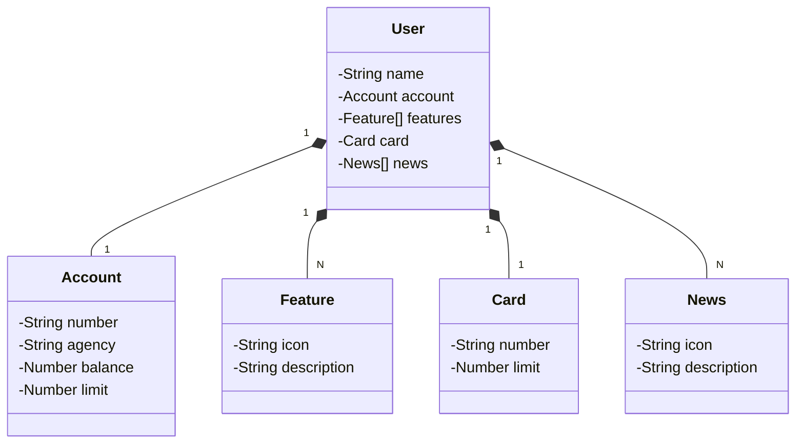

# Decola Tech 2025

Projeto do Decola Tech, com Java RESTful API em Gradle - Groovy, originalmente foi um projeto da Santander Dev Week.

## Principais Tecnologias
 - **Java 21**
 - **Spring Boot 3.4.3**
 - **Spring Data JPA**
 - **OpenAPI (Swagger)**
 - **Railway**

## Diagrama de Classes (Domínio da API)


## Railway Link
https://web-production-6430a.up.railway.app/swagger-ui/index.html#/
Exemplo para adicionar um novo usuário:
```json
{
  "name": "nome do usuário",
  "account": {
    "number": "00000000-0",
    "agency": "xxxxx",
    "balance": 00.00,
    "limit": 00.00
  },
  "card": {
    "number": "xxxx xxxx xxxx 0000",
    "limit": 00.00
  },
  "features": [
    {
      "icon": "pix",
      "description": "fazer pix"
    }
  ],
  "news": [
    {
      "icon": "propaganda",
      "description": "propaganda 1"
    }
  ]
}
```
